# VibeHub

## Features

Web application has the following pages:

1. User Authentication & Account Management
   - User registration & login via Django Allauth.
   - Secure password hashing & authentication.
   - Logout functionality.

2. Post Management
   - Users can create, edit, and delete their own posts.
   - Posts can include text and categories.
   - Users can browse posts sorted by time or categories.

3. Reporting & Moderation
   - Users can report inappropriate content.
   - Admins can review & moderate reports.

4. Pagination & Navigation
   - Paginated feed (7 posts per page).
   - Responsive navbar with a collapsible menu.

5. Security & Performance
   - CSRF protection & input validation.
   - Optimized queries to ensure fast loading times.

### Access control table:

| Feature   | Unauthenticated User        | Authenticated User      | Admin | 
| ------------- | ------------- | ------------- | ---------- |
| Browse Posts                  | Y | Y | Y |
| View About Page               | Y | Y | Y |
| Register an Account           | Y | N | N |
| Log In                        | Y | N | N |
| Log Out                       | N | Y | Y |
| Create a Post                 | N | Y | Y |
| Edit Own Posts                | N | Y | Y |
| Delete Own Posts              | N | Y | Y |
| Report a Post                 | N | Y | Y |
| View Reported Posts           | N | N | Y |
| Moderate Reports              | N | N | Y |
Y = Yes; N = No

- Each page has a navbar and a footer

**Navbar**

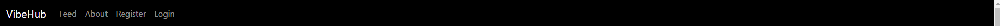

Navbar has the following links:
- Feed page
- About page
- Register / Login / Logout
- It also has the VibeHub brand logo.

The simplistic design of the navbar is based on the decision to make the use of the webapp easy for the user. 

When the user is logged in, the navbar looks as follows.

**Footer**

Footer has the following sections:

- Year and VibeHub brand logo:
- Information about the coder which links to GitHub:
- Links to the feed and about page:
- Social media links to x and instagram which open on a different page:

  

**Feed page**

- The Feed page displays the user log status, links to feed, about, register and login pages, main topics, latest posts, pagination buttons and the footer.
- The user log status is always displayed below the navigation bar.

- 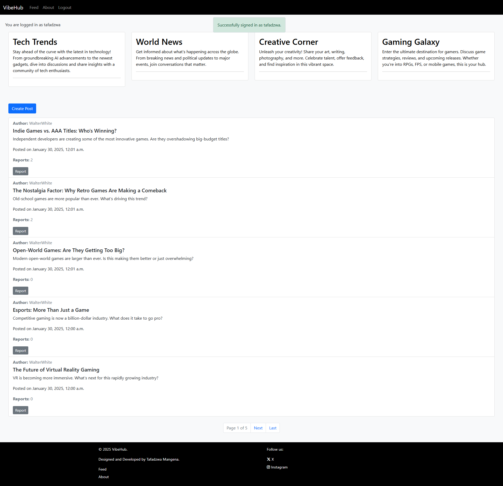

**About page**

- This page contains information about VibeHub, the mission, what is offered and the values of the web application.
- The user log status is always displayed below the navigation bar.

- 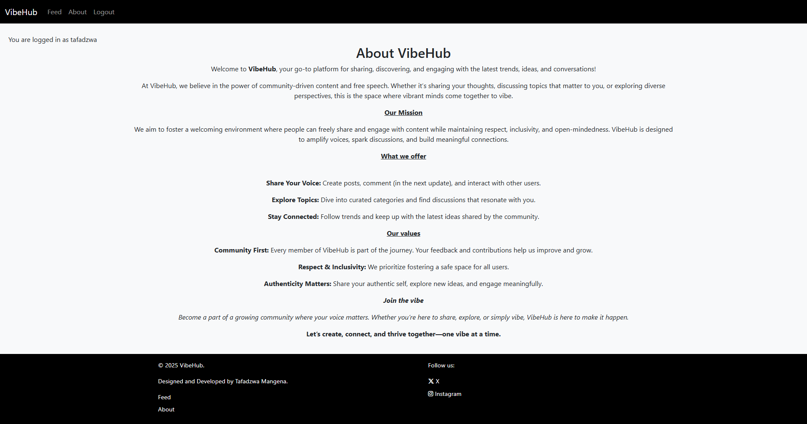

**Registration Page**

- This link redirects the user to the sign up page and requests username, email (optional) and password to register a user and redirects them back to the feed now as a logged in user.
- The user log status is always displayed below the navigation bar.

- 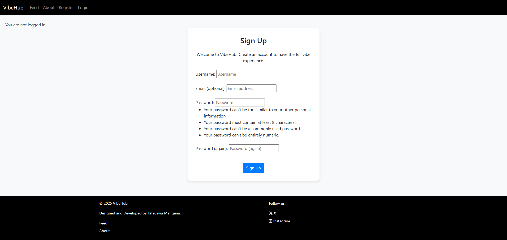

**Login page**

- Login Page has a login form which requests the correct user name and password and a option to save the information on the local device for quicker sign in next time. 
- Once the user signs in they are redirected to the feed page.
- The user log status is always displayed below the navigation bar.

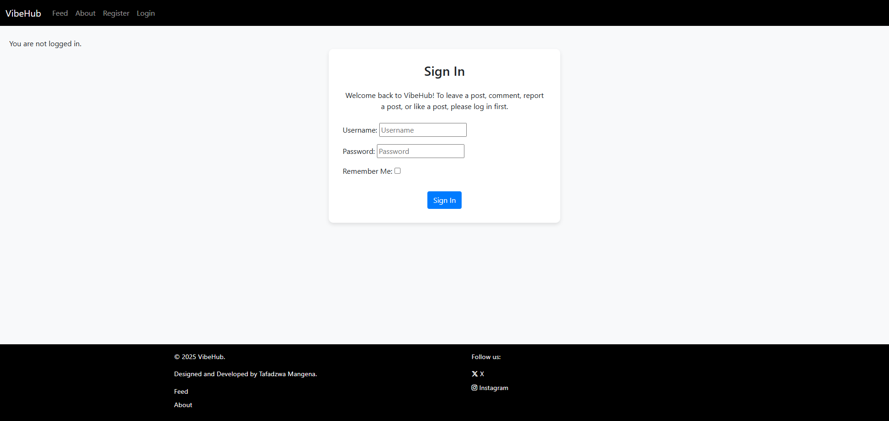

**Logout page**

- This page has a confirmation message to sign out.
- If user clicks the sign out button they are signed out and redirected to the feed page as an unauthenticated user.
- The user log status is always displayed below the navigation bar.

- 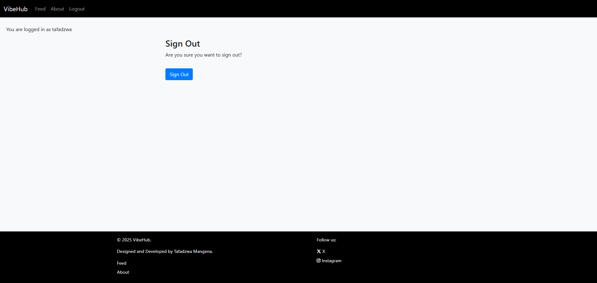

**Topic Posts page**

- This page displays all posts related to selected topic.
- If user clicks the "back to feed" button they are redirected to the feed.
- The user log status is always displayed below the navigation bar.

- 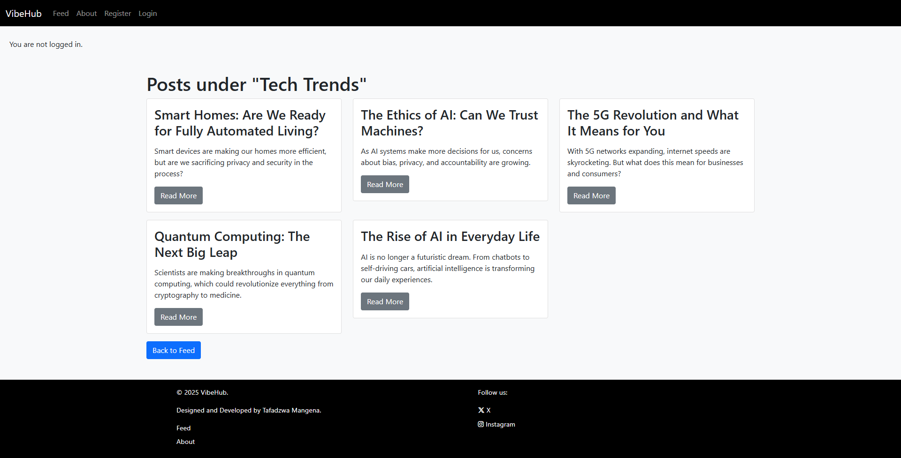

**Topic Posts Detail page**

- This page displays all information of selected post.
- If user clicks the "back to feed" button they are redirected to the feed.
- The user log status is always displayed below the navigation bar.

- 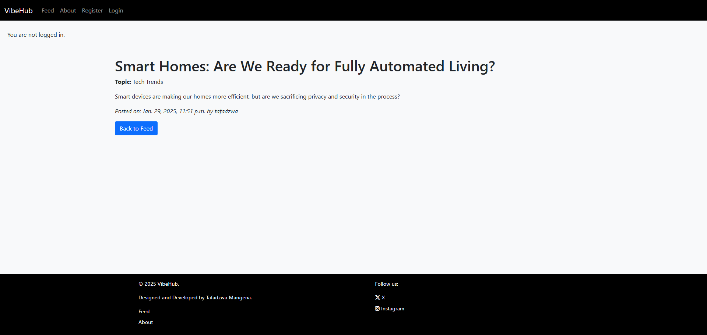

**Edit Post page**

- This page displays a form to allow user to edit title, topic and content.
- The form has a "cancel" button that redirects the user back to the feed.
- If user clicks the "update post" the post is updated and they are redirected to the feed.
- The user log status is always displayed below the navigation bar.

- 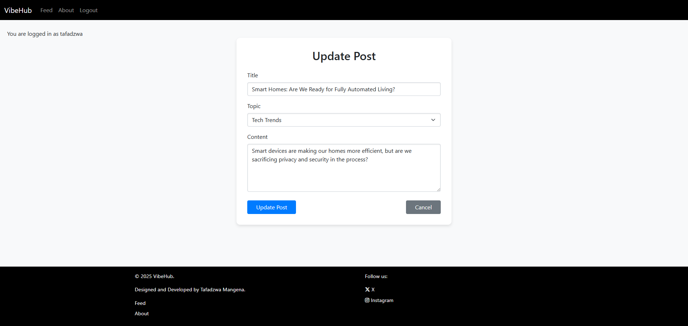

**Delete Post page**

- This "delete" button pops up a modal to confirm the deletion of the post.
- The form has a "cancel" button that redirects the user back to the feed.
- If user clicks the "delete" the post is deleted and they are redirected to the feed.

- 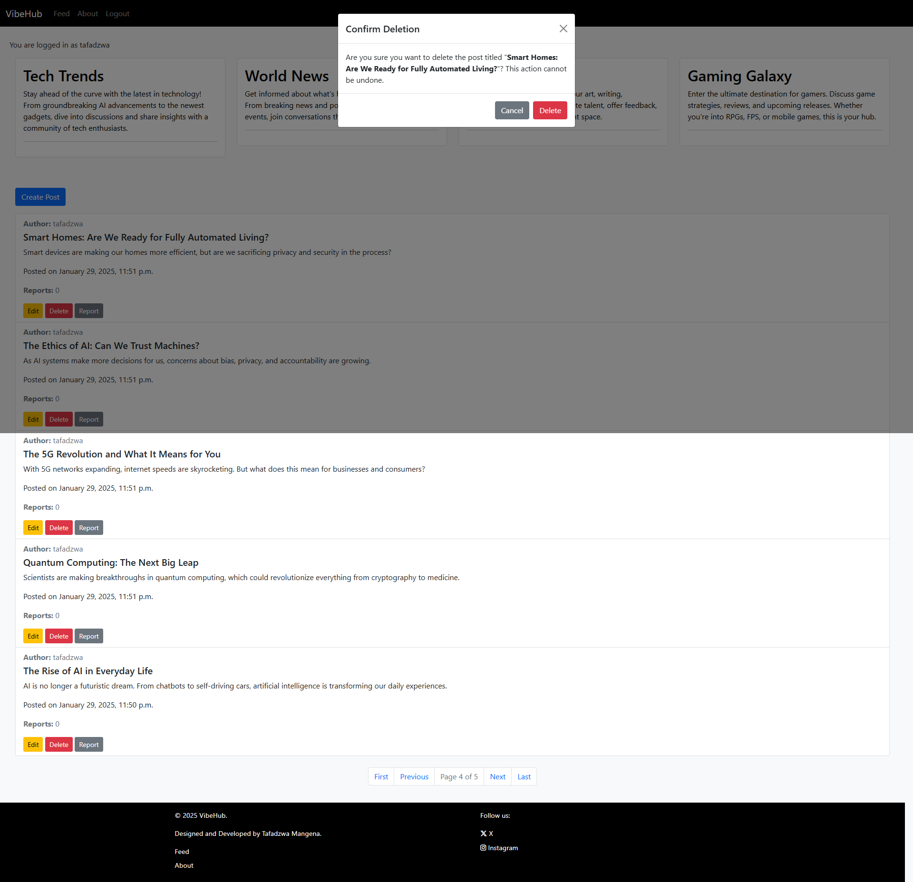

**Report Post page**

- The page has a form to report post, the form is valid when a reason is selected.
- The form has a "cancel" button that redirects the user back to the feed.
- If user clicks the "report" the post is reported and they are redirected to the feed.

- 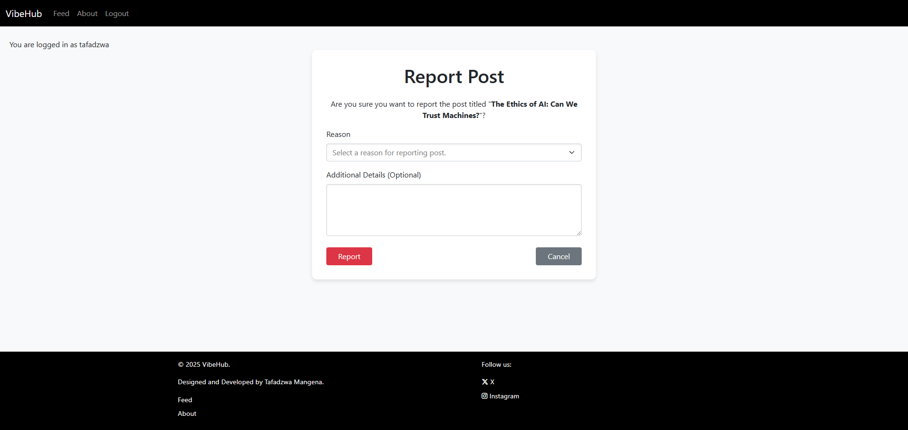

**Error Page**

- There is a 404 error page with a 404 image, page not found and a short message about the error ("Oh! It seems that this page doesn't exist.").
- Below the message there is a "Back to Feed" button which redirects user back to the feed page.
- The user log status is always displayed below the navigation bar.

 - 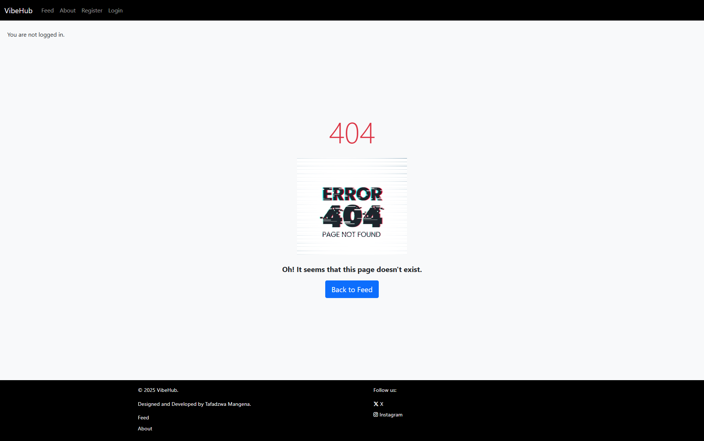

**Favicon**

  - The favicon is a small image that is displayed in the browser's address bar. It is used to identify the website among others and help the user to find it when they are searching for it.
  
- 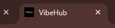

---