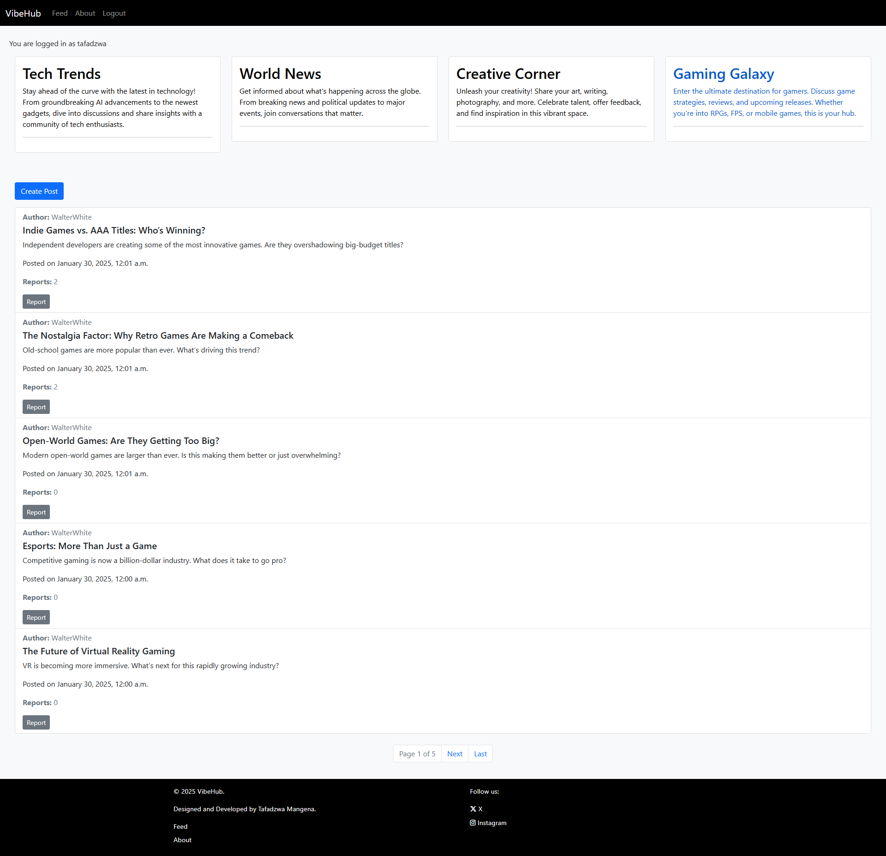
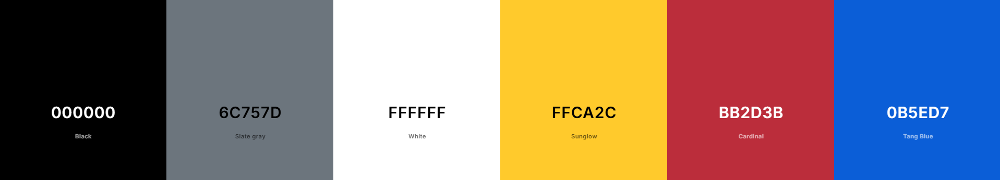
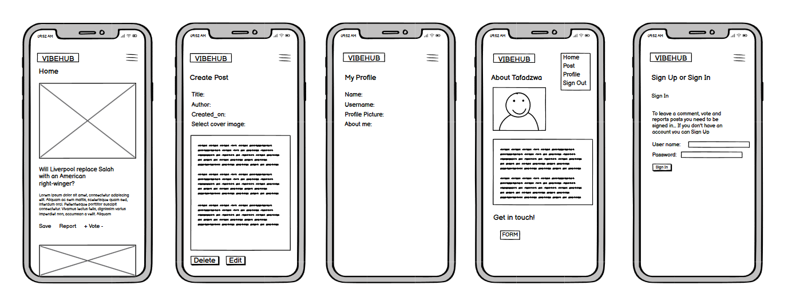
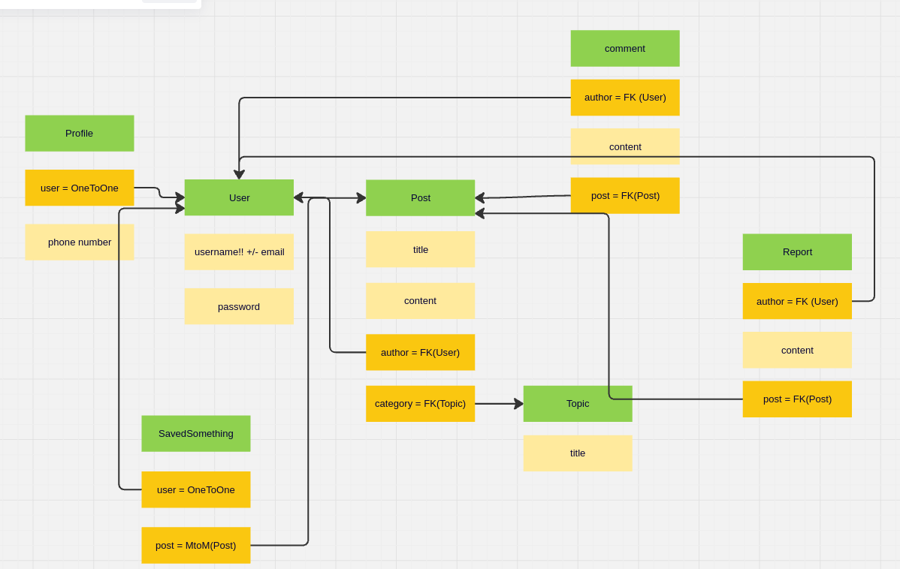

# VibeHub

Live Version: [VibeHub](https://vibehub-d3289bc84e8e.herokuapp.com/)

Repository: [GitHub Repo](https://github.com/TafadzwaMangena/VibeHub)

The app is developed by [Tafadzwa Mangena](https://github.com/TafadzwaMangena).

## About

[VibeHub](https://vibehub-d3289bc84e8e.herokuapp.com/) is a dynamic social media platform where users can share news, engage in discussions, and interact through posts. It allows users to create, update, and delete posts, explore different topics, and report inappropriate content. The platform fosters an interactive community-driven experience with a focus on trending discussions.

## User Experience Design

### Strategy

VibeHub is designed with a user-first approach, ensuring accessibility, usability, and engagement. The interface is intuitive, catering to both new and experienced users with a clear navigation structure.

### Target Audience

VibeHub caters to a broad audience, from social media users to content creators, students, and discussion enthusiasts. By fostering engagement, inclusivity, and real-time interaction, it aims to be a go-to platform for meaningful online discussions. The target audience includes:
  * Social Media Enthusiasts;
  * News & Discussion Seekers;
  * Bloggers & Content Creators;
  * Students & Researchers;
  * Online Communities & Niche Interest Groups;
  * People Seeking a Safe, Inclusive Discussion Space;

### User Stories

#### **First Time Visitor Goals**

| Issue     | User Story |
|-------------|-------------|
|[Account Registration](https://github.com/TafadzwaMangena/VibeHub/issues/1)|As a new user, I want to register an account so that I can participate in discussions.  |
|[Account Login](https://github.com/TafadzwaMangena/VibeHub/issues/2)|As a returning user, I want to log into my account so that I can access my personalized feed. |

#### **Frequent User Goals**

| Issue       | User Story |
|-------------|-------------|
|[Create Post](https://github.com/TafadzwaMangena/VibeHub/issues/3)|As a registered user, I want to create posts so that I can share my thoughts with the community.  |
|[Browse Posts](https://github.com/TafadzwaMangena/VibeHub/issues/4)|As a user, I want to browse posts so that I can stay updated with trending discussions.  |
|[Choose Topic](https://github.com/TafadzwaMangena/VibeHub/issues/7)|As a user, I want to filter posts by topics so that I can find content relevant to my interests.  |
|[Edit/Delete Own Posts](https://github.com/TafadzwaMangena/VibeHub/issues/9)|As a user, I want to edit or delete my posts so that I can correct mistakes or remove content I no longer want to share.  |
|[Report Inappropriate Content](https://github.com/TafadzwaMangena/VibeHub/issues/11)|As a user, I want to report inappropriate content so that the platform remains a safe space. |

#### **Admin Goals**

| Issue     | User Story |
|-------------|-------------|
|[Admin Moderation](https://github.com/TafadzwaMangena/VibeHub/issues/8)|As an admin, I want to moderate posts and user-reported content so that I can ensure the platform maintains community guidelines.  |

---

## Technologies used

- ### Languages:
    
    + [Python 3.8.5](https://www.python.org/downloads/release/python-385/): the primary language used to develop the server-side of the website.
    + [JS](https://www.javascript.com/): the primary language used to develop interactive components of the website.
    + [HTML](https://developer.mozilla.org/en-US/docs/Web/HTML): the markup language used to create the website.
    + [CSS](https://developer.mozilla.org/en-US/docs/Web/css): the styling language used to style the website.

- ### Frameworks and libraries:

    + [Django](https://www.djangoproject.com/): python framework used to create all the logic.
    + [jQuery](https://jquery.com/): was used to control click events and sending AJAX requests.
    + [Bootstrap](https://getbootstrap.com/) was used for responsive UI and styling.

- ### Databases:

    + [Heroku](https://www.sqlite.org/): was used f hosting the deployed application.
    + [SQLite](https://www.sqlite.org/): was used as a local database for development.
    + [PostgreSQL](https://www.postgresql.org/): was used as a production database.

- ### Other tools:

    + [Git](https://git-scm.com/): the version control system used to manage the code.
    + [Pip3](https://pypi.org/project/pip/): the package manager used to install the dependencies.
    + [Gunicorn](https://gunicorn.org/): the webserver used to run the website.
    + [Spycopg2](https://www.python.org/dev/peps/pep-0249/): the database driver used to connect to the database.
    + [Django-allauth](https://django-allauth.readthedocs.io/en/latest/): the authentication library used to create the user accounts.
    + [Django-crispy-forms](https://django-cryptography.readthedocs.io/en/latest/): was used to control the rendering behavior of Django forms.
    + [GitHub](https://github.com/): used to host the website's source code.
    + [VSCode](https://code.visualstudio.com/): the IDE used to develop the website.
    + [Chrome DevTools](https://developer.chrome.com/docs/devtools/open/): was used to debug the website.
    + [Font Awesome](https://fontawesome.com/): was used to create the icons used in the website.
    + [Coolors](https://coolors.co/202a3c-1c2431-181f2a-0b1523-65e2d9-925cef-6b28e0-ffffff-eeeeee) was used to make a color palette for the website.
    + [W3C Validator](https://validator.w3.org/): was used to validate HTML5 code for the website.
    + [W3C CSS validator](https://jigsaw.w3.org/css-validator/): was used to validate CSS code for the website.
    + [JShint](https://jshint.com/): was used to validate JS code for the website.
    + [CI Python Linter](https://pep8ci.herokuapp.com/): was used to validate Python code for the website.
    + [GIMP](https://www.gimp.org/) was used to make and resize images for the README file.
    + [gitpod](https://www.gitpod.io/)  and [VSCode](https://code.visualstudio.com/) were used as the main tools to write and edit code.
    + [Balsamiq wireframes](https://balsamiq.com/) was used to generate the wireframes.

---

## FEATURES

Please refer to the [FEATURES.md](FEATURES.md) file for all features-related documentation.

---

## Design

VibeHub follows a clean, modern, and user-friendly design, balancing aesthetics with usability. The design choices align well with the social media nature of the platform, ensuring users can navigate, interact, and engage effortlessly. 

### Color Scheme

The color scheme of the application is based on simple black and white color schemes with buttons using default bootstrap color schemes:

  

### Imagery

- The 404 error image was downloaded from [pexels.com](https://www.pexels.com/).

- The favicon was generated and downloaded from [favicon.ico](https://favicon.io/).

### Wireframes

- [Large Screen Wireframes](documentation/readme/wireframes-desktops.pdf)
- 

---

## Flowchart

The following flowchart was created to help to understand the application and its functionality.

The flowchart represents the logic of the application:

The flowchart was created using [Lucid Charts](https://lucid.app/documents#/home?folder_id=recent)

 

## Information Architecture

### Database

* The database was migrated to PostgreSQL.

### Entity-Relationship Diagram

* The ERD was created using [Draw.io](https://www.lucidchart.com/).

- [Database Scheme](.pdf)

---

## Testing

Please refer to the [TESTING.md](TESTING.md) file for all test-related documentation.

---

## Deployment

- The app was deployed to [Heroku](https://dashboard.heroku.com/).
- The app can be reached by the [link](https://vibehub-d3289bc84e8e.herokuapp.com/).

Please refer to the [DEPLOYMENT.md](DEPLOYMENT.md) file for all deployment-related documentation.

---

## Credits

- [GitHub](https://github.com/) for giving the idea of the project's design.
- [Django](https://www.djangoproject.com/) for the framework.
- [Font awesome](https://fontawesome.com/): for the free access to icons.
- [Heroku](https://www.heroku.com/): for the free hosting of the website.
- [Coolors](https://coolors.co/): for providing a free platform to generate your own palette.
- [Postgresql](https://www.postgresql.org/): for providing a free database.
- [Codemy.com](https://www.youtube.com/watch?v=N-PB-HMFmdo): for providing a free video on how to implement pagination in the project.
- [Responsive Viewer](https://chrome.google.com/webstore/detail/responsive-viewer/inmopeiepgfljkpkidclfgbgbmfcennb/related?hl=en): for providing a free platform to test website responsiveness
- [GoFullPage](chrome://extensions/?id=fdpohaocaechififmbbbbbknoalclacl): for allowing to create free full web page screenshots;
- [Favicon Generator](https://favicon.io/): for providing a free platform to generate favicons.
- [Tutorial Republic](https://www.tutorialrepublic.com/) for assisting with the code for javascript function to add tooltips.
- [Stack Overflow](https://www.tutorialrepublic.com/) assistance on designing my report model and other questions.
- [Code Institute Django Blog](https://codeinstitute.net/global/) for inspiring the idea to create VibeHub.

*All users are fictional, The content currently on the website was auto generated using ChatGPT to give real life application of the website.*

---

## Acknowledgments

- My wife Kim was supportive though out the building of the website and gave me ideas.
- [IuIiia  Konovalova](https://github.com/IuliiaKonovalova), my mentor, who assisted me and guided me through the whole development with insightful knowledge.
- Rebecca, a tutor at Code Institute. 