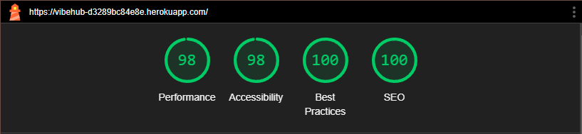
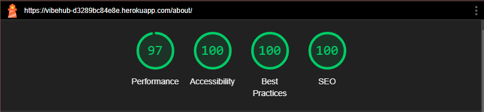
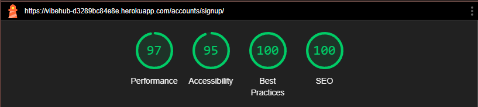
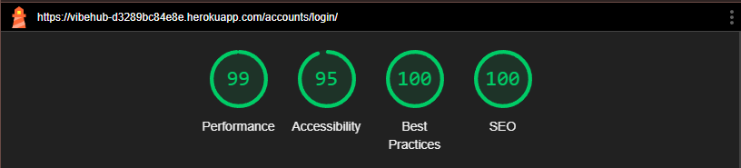
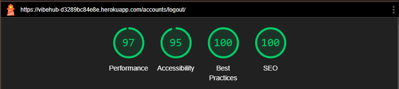
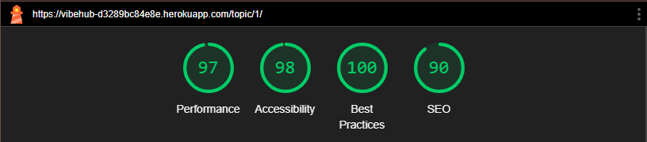
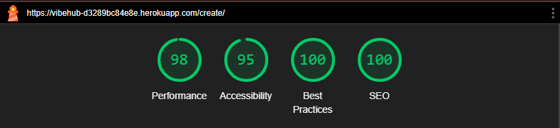
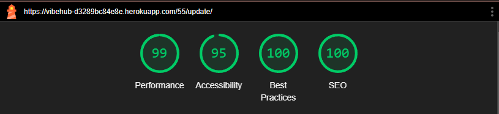
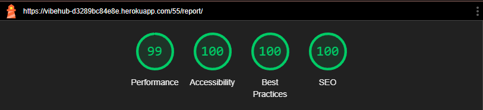

# Testing

## Manual Testing

Testing was done throughout site development, for each feature before it was merged into the master file.

Usability was tested with the below user acceptance testing, sent to new users to ensure testing from different users, on different devices and browsers to ensure issues were caught and where possible fixed during development.

|        | User Actions           | Expected Results | Y/N | Comments    |
|--------|------------------------|------------------|-----|-------------|
| 1      | Click on the VibeHub brand logo | Redirect to feed page | Y |  |
| 2      | Click on the Feed link          | Redirect to feed page | Y |  |
| 3      | Click on the About link         | Redirect to about page| Y |  |
| 4      | Click on the Register link      | Redirect to sign-up page | Y | Only visible to unauthenticated users. |
| 5      | Sign up form: Fill form and click "sign in" | Authenticate user and redirect to feed page. | Y |  |
| 6      | Click on the Login link  | Redirect user to sign-in page | Y | Only visible to unauthenticated users. |
| 7      | Sign-in form: Fill form and click "sign in" | Redirect to feed page | Y |  |
| 8      | Data base changes | Django message pops up and informs user of changes | Y |  |
| 9      | Log status | Display "You are not logged in." for unauthenticated users and "You are logged in as {{ user }} for authenticated users. | Y |  |
| 10     | Click on topics 1, 2, 3 and 4 | Redirect to topic post page | Y | Displays all posts related to that topic. |
| 11      | Click on "read more" in topic posts | Redirect to post detail page page | Y |  |
| 12      | Click on "back to feed" button | Redirect to feed page | Y |  |
| 13      | Click on the "Create Post" button | Redirect to post create page | Y | Create button only visible to authenticated users. |
| 14      | Create Post form: Click on "submit" button | Post form, display above all current posts, redirect user to feed page.  page | Y |  |
| 15      | Click on "edit" button | Redirect to update post page | Y | Button only visible to post author. |
| 16      | Click on "cancel" button | Redirect to feed page | Y |  |
| 17      | Click on "update post" button | Post is updated with new information, redirect to feed page | Y |  |
| 18      | Click on "delete" button | Pops modal to confirm deletion | Y | Button only visible to post author |
| 19      | Click on "delete" (in the modal) | Deletes posts and redirect to feed page | Y | Modal only visible to post author |
| 20      | Click on "Report" button | Redirect to report post page | Y | For Authenticated users |
| 21      | Click on "Report" | If reason is selected add report increment to post and redirect to feed page | Y | For Authenticated users |
| 22      | Hover over "report" button | Pops up tooltip message "Register or Login to report this post" | Y | For un-authenticated users |
| 23      | Scroll on feed page | Browse through posts | Y |  |
| 24      | Pagination - Click on Next | Redirect to next page | Y |  |
| 25      | Pagination - Click on Previous | Redirect to previous page | Y |  |
| 26      | Pagination - Click on Last | Redirect to last page | Y |  |
| 27      | Pagination - Click on First | Redirect to first page | Y |  |
| 28      | Click on the VibeHub brand logo | Redirect to feed page | Y |  |
| 29      | Pagination | Display "page number" of "total pages" | Y |  |
| 30      | Footer - Click on Tafadzwa Mangena | Redirect to Tafadzwa Mangena's Github | Y |  |
| 31      | Footer - Click on the Feed link          | Redirect to feed page | Y |  |
| 32      | Footer - Click on the About link         | Redirect to about page| Y |  |
| 33      | Click on X social media link | Redirect to x.com on a different page | Y |  |
| 34      | Click on Instagram social media link | Redirect to instagram.com on a different page | Y |  |

---

## Testing User Story

| First Time Visitor Goals | User Story Requirement met | Condition met Y/N |
| ------------------------- | --------------- | ----- |
| Account Registration | As a new user, I want to register an account so that I can participate in discussions.| Y |
| Account Login | As a returning user, I want to log into my account so that I can access my personalized feed. | Y |

| Frequent Visitor Goals    | User Story Requirement met | Condition met Y/N |
| ------------------------- | --------------- | ----- |
| Create Post | As a registered user, I want to create posts so that I can share my thoughts with the community. | Y |
| Browse Posts | As a user, I want to browse posts so that I can stay updated with trending discussions. | Y |
| Choose Topic | As a user, I want to filter posts by topics so that I can find content relevant to my interests. | Y |
| Edit/Delete Own Posts | As a user, I want to edit or delete my posts so that I can correct mistakes or remove content I no longer want to share. | Y |
| Report Inappropriate Content | As a user, I want to report inappropriate content so that the platform remains a safe space. | Y |

| Admin Goals    | User Story Requirement met | Condition met Y/N |
| ------------------------- | --------------- | ----- |
| Admin Moderation| As an admin, I want to moderate posts and user-reported content so that I can ensure the platform maintains community guidelines. | Y |

---

## Bugs

### Known bugs

When the navigation bar is collapsed, The button should be aligned to the right of the navigation bar. However it is stuck on left side due to bootstrap styles.

### Solved bugs

Since this project served as a learning platform for me and enabled me to greatly advance my knowledge and abilities, there were many bugs during the development process.

But I made an effort to address most of them. All Auth forms were not properly displaying so I customized them. Another bug I recall is Bootstrap integrity was causing some styles not to display on the deployed site. The solution I used was to remove it all.

---

## Validation:
### HTML Validation:

- [Full HTML Validation Report](documentation/testing/html_validation.pdf)

- No errors or warnings were found when passing through the official [W3C](https://validator.w3.org/) validator. This checking was done manually by copying the view page source code (Ctrl+U) and pasting it into the validator.

### CSS Validation:

- [Full CSS Validation Report](documentation/testing/css-validation.pdf)

- No errors or warnings were found when passing through the official [W3C (Jigsaw)](https://jigsaw.w3.org/css-validator/#validate_by_uri) validator except for the warnings about the use of css root variables and webkits for the box-shadow. However, css code works perfectly on various devices.

### JS Validation:

- [Full JS Validation Report](documentation/testing/jshint.pdf)

- No errors or warning messages were found when passing through the official [JSHint](https://www.jshint.com/) validator.
  
### Python Validation:

- [Full Python Validation Report](documentation/testing/python_validation.pdf)

- No errors were found when the code was passed through the [CI Python Linter](https://pep8ci.herokuapp.com/). This checking was done manually by copying python code and pasting it into the validator.

---
## Lighthouse Report

### Feed Page

### About Page

### Register Page

### Login Page

### Logout Page

### Topic details Page

### Create Post Page

### Edit Post Page

### Report Page

---

## Compatibility

Testing was conducted on the following browsers;

- Chrome;
- Firefox;
- Opera;

This is proven on the uploaded files and photos.

---

# Responsiveness

The responsiveness was checked manually by using devtools (Chrome) throughout the whole development. It was also checked with [Responsive Viewer](https://chrome.google.com/webstore/detail/responsive-viewer/inmopeiepgfljkpkidclfgbgbmfcennb/related?hl=en) Chrome extension.

- [Responsiveness Report Feed page](documentation/testing/responsiveness-feed-page.pdf)
- [Responsiveness Report About page](documentation/testing/responsiveness-about-page.pdf)
- [Responsiveness Report Create Post page](documentation/testing/responsiveness-create-post-page.pdf)
- [Responsiveness Report Topic Post page](documentation/testing/responsiveness-topic-post-detail-page.pdf)

---